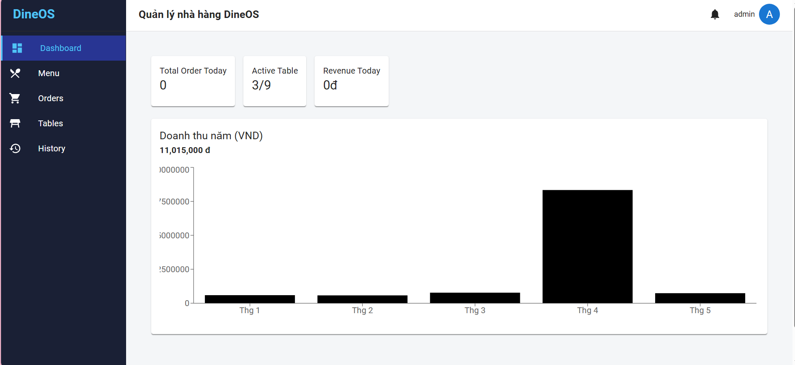
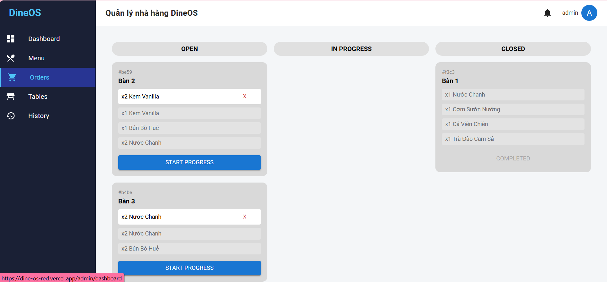
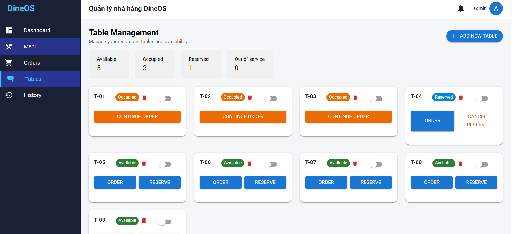
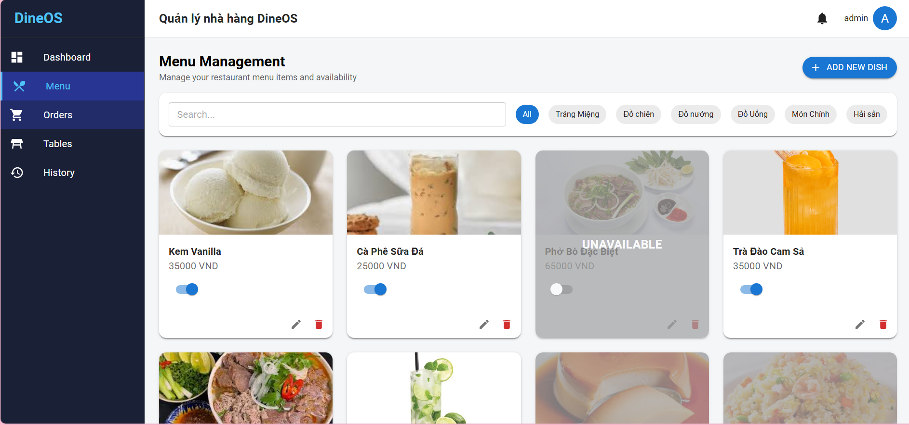
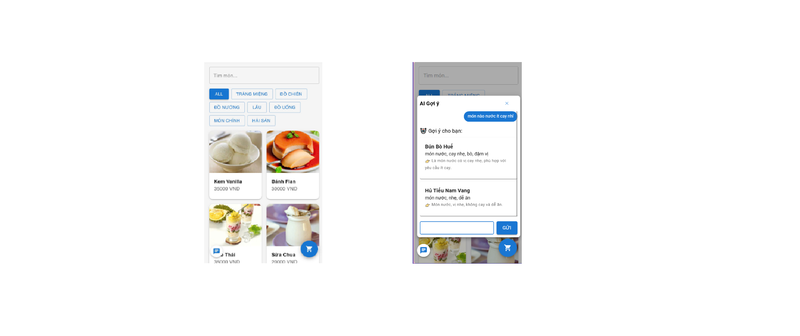

# DineOS

A modern restaurant management system built with C# and JavaScript.

[](https://github.com/puipui0909/DineOS)
[]([https://dine-os-seven.vercel.app](https://dine-os-red.vercel.app/))
[](#-tech-stack)

## 📋 Overview

DineOS is a restaurant management system built with ASP.NET Core and JavaScript. It provides features for managing menus, tables, orders, payments, and user roles through a web-based interface.

## ✨ Features

- **Order Management** - Efficiently process and track restaurant orders
- **Table Reservations** - Manage table bookings and reservations
- **Menu Management** - Organize and update restaurant menu items
- **Reporting & Analytics** - Generate business insights and reports
- **User Authentication** - Secure login system with role-based access
- **Responsive Design** - Works seamlessly on desktop and mobile devices

## 🚀 Tech Stack

- **Backend**: ASP.NET Core Web API
- **Frontend**: JavaScript
- **Database**: MySQL
- **Authentication**: JWT
- **AI Integration**: Gemini API
- **Deployment**: Render & Vercel

### Language Composition
- C#: 60.9%
- JavaScript: 37.7%
- CSS: 1.1%
- Other: 0.3%

## 📦 Installation

### Prerequisites
- .NET SDK 8.0
- Node.js and npm
- Git

### Steps

1. **Clone the repository**
```bash
git clone https://github.com/puipui0909/DineOS.git
cd DineOS
```

2. **Install backend dependencies**
```bash
# If using .NET
dotnet restore
```

3. **Install frontend dependencies**
```bash
npm install
```

4. **Configure environment variables**
Create a `.env` file with your configuration:
```
ConnectionStrings__DefaultConnection=

Jwt__Key=
Jwt__Issuer=
Jwt__Audience=

GEMINI_API_KEY=
```

5. **Run the application**
```bash
# Terminal 1 - Backend
dotnet run

# Terminal 2 - Frontend
npm start
```

## 🎯 Usage

1. Open your browser and navigate to the application
2. Log in with your credentials
3. Log in with your account and access features based on your assigned role.
4. Start managing your restaurant operations

For detailed usage instructions, please refer to the [documentation](./docs) or visit the [live website](https://dine-os-seven.vercel.app).

## 📝 License

This project is currently unlicensed. Please check back for license information or contact the repository owner.

## 📞 Contact

- **Author**: [puipui0909](https://github.com/puipui0909)
- **Repository**: [DineOS](https://github.com/puipui0909/DineOS)
- **Website**: [https://dine-os-seven.vercel.app](https://dine-os-seven.vercel.app)

---

## Screenshots

<h3>Dashboard</h3>
<p align="center">
  
</p>

<h3>Core Features</h3>

<p align="center">
  
  
</p>

<p align="center">
  
  
</p>


**Happy Restaurant Managing! 🍽️**
